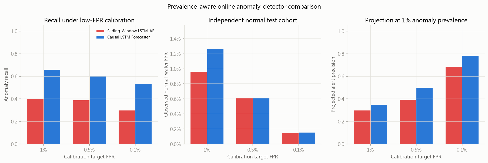
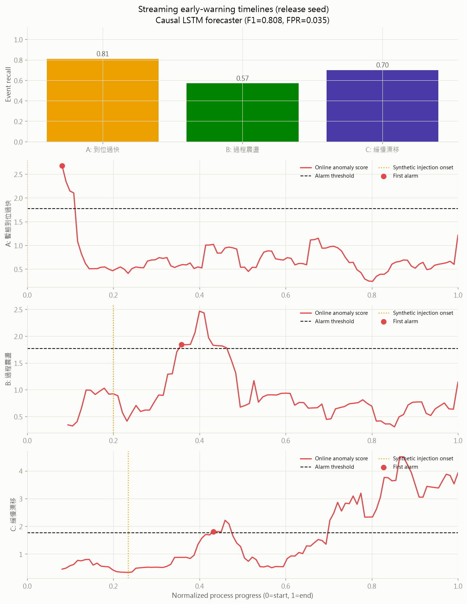

# Semiconductor Process Anomaly Detection with Edge AI

以 LAM 9600 蝕刻製程資料建立時間序列異常偵測實驗，研究「最終值相同，但暫態過程不同」的監控盲區。V2 主模型為可在製程途中告警的 Sliding-Window LSTM Autoencoder；完整 wafer LSTM-AE、causal LSTM forecaster、Dense AE、Isolation Forest 與 SPC 作為比較。

> 本專案是研究原型，不是經認證的設備安全聯鎖或良率保證系統。

## 研究問題

只檢查製程終值，無法區分下列兩條可能具有不同風險的軌跡：

- 正常時間內平穩到達設定點。
- 過快到位、過程震盪或緩慢漂移，但結束時仍回到正常範圍。

目前資料沒有溫度欄位，因此「0.001 秒升到 200°C」只能作為研究動機，不能宣稱已由 LAM 9600 驗證。程式中的 Type A 已改名為「暫態到位過快」，其實驗載體是 Pressure/Vat Valve 等製程暫態。

## 模型配置

| 方法 | 用途 | 輸入 | 製程途中告警 |
|---|---|---|---:|
| Final-value SPC X-bar | 終值監控盲區示例 | 每片最終值 | 否 |
| Isolation Forest | 非神經基準 | 固定長度攤平序列 | 否 |
| Dense AE | 無 recurrent bias 的 AE 基準 | 固定長度完整序列 | 否 |
| LSTM-AE | 完整 wafer 重建與離線確認 | 變長完整序列 | 否 |
| Sliding-Window LSTM-AE | V2 主模型：線上重建與連續告警 | 最近 8/16/32/64 點 | 是 |
| Causal LSTM forecaster | 線上一步預測比較模型 | 逐筆 sensor 樣本 | 是 |

Sliding-Window LSTM-AE 在時間 `t` 只重建最近的 trailing window，不使用 `t` 之後的資料。發布設定為 32 點視窗、視窗平均重建誤差與 `3-of-5` 連續告警。Forecaster 只保留為相同因果條件下的比較模型。

## 已核實的資料狀態

- 原始 `.mat`：108 normal、21 faulty。
- 套用 `MIN_WAFER_LEN=60`：107 normal、20 faulty。
- Normal 固定切分：64 片統計/校準組、43 片最終保留組。
- Step 4+5 長度：95 到 112 點，平均約 100.7 點。
- `Time` 正間隔中位數：1.0200；P05 到 P95：0.9961 到 1.0488。
- 若 `Time` 單位為秒，中位取樣率約 0.980 Hz，因此不能用這份資料驗證毫秒級熱行為。
- 模型 sensors：Cl2 Flow、He Press、Pressure、Vat Valve；沒有 Temperature。

## V2 主模型結果

既有 500 片開發測試集曾在 V2 迭代時被查看，因此不再稱為完全未接觸的最終測試。5 seeds 的開發結果為：

| 指標 | Mean | Std |
|---|---:|---:|
| Precision | 0.946 | 0.007 |
| Recall | 0.424 | 0.028 |
| F1 | 0.585 | 0.028 |
| Normal-wafer FPR | 0.036 | 0.005 |
| ROC-AUC | 0.720 | 0.017 |

模型凍結後，另以 5,000 normal 校準、10,000 normal holdout 與 A/B/C 各 1,000 的新資料做一次最終評估：

| 模型 | 目標 FPR | 實測 FPR (95% CI) | Recall (95% CI) |
|---|---:|---:|---:|
| Sliding-Window LSTM-AE | 1.0% | 0.91% (0.74%-1.12%) | 0.358 (0.341-0.375) |
| Sliding-Window LSTM-AE | 0.5% | 0.44% (0.33%-0.59%) | 0.318 (0.302-0.335) |
| Sliding-Window LSTM-AE | 0.1% | 0.11% (0.06%-0.20%) | 0.250 (0.235-0.265) |
| Causal LSTM forecaster | 1.0% | 0.98% (0.80%-1.19%) | 0.603 (0.585-0.620) |

主模型在 1% 目標下的 A/B/C Recall 為 `0.015/0.492/0.566`。這支持低誤報的因果邊緣原型，但也顯示 LSTM-AE 對快速暫態明顯不足；結果不支持直接產線上線或「全面優於 Forecaster」。

最終 holdout 與訓練資料仍共用同一合成機制，因此只能降低調參洩漏，不能取代新的真實高頻製程資料。



## 串流早期預警結果

合成測試集為 200 normal 加 Type A/B/C 各 100；5 seeds 結果如下：

| 指標 | Mean | Std |
|---|---:|---:|
| Precision | 0.971 | 0.007 |
| Recall | 0.663 | 0.033 |
| F1 | 0.787 | 0.022 |
| Normal wafer FPR | 0.030 | 0.008 |
| Pre-onset alarm rate | 0.000 | 0.000 |

| 異常類型 | Recall mean | 首次告警進度 | 告警時剩餘序列比例 |
|---|---:|---:|---:|
| A：暫態到位過快 | 0.720 | 0.087 | 0.913 |
| B：過程震盪 | 0.576 | 0.557 | 0.443 |
| C：緩慢漂移 | 0.692 | 0.837 | 0.163 |

只有合成異常 onset 之後的首次越界才算 true positive；注入前越界另計為 pre-onset alarm，避免把誤報包裝成提前命中。



## 完整序列基準結果

LSTM-AE 在 5 seeds 的合成測試集結果為 Precision `0.976 +/- 0.008`、Recall `0.649 +/- 0.025`、F1 `0.780 +/- 0.020`、FPR `0.024 +/- 0.007`。下表則使用發佈 seed 43，與其他完整序列方法在同一測試集比較：

| 方法 | Precision | Recall | F1 | FPR |
|---|---:|---:|---:|---:|
| Final-value SPC X-bar | 0.882 | 0.050 | 0.095 | 0.010 |
| Dense AE | 0.932 | 0.773 | 0.845 | 0.085 |
| Isolation Forest | 0.667 | 0.040 | 0.075 | 0.030 |
| LSTM-AE | 0.986 | 0.697 | 0.816 | 0.015 |

Dense AE 的 F1 高於該 LSTM-AE release seed，但 FPR 也較高；本結果不支持「LSTM-AE 全面優於 Dense AE」。兩者都需完整 wafer，不能代替 causal forecaster 的途中告警角色。

## 真實資料 sanity check

真實保留組為 43 normal 加 20 faulty。這些 faulty 主要是設定點偏移，沒有經核實的 fault-onset timestamp，也不是合成 A/B/C 的真實複本：

| 方法/設定 | Normal FPR | Fault recall | ROC-AUC |
|---|---:|---:|---:|
| LSTM-AE direct transfer | 0.140 | 0.800 | - |
| LSTM-AE real-normal recalibration | 0.047 | 0.700 | 0.907 |
| Final-value SPC X-bar | 0.000 | 0.250 | - |
| Dense AE | 0.000 | 0.650 | 0.923 |
| Causal LSTM forecaster | 0.047 | 0.650 | 0.910 |
| Sliding-Window LSTM-AE | 0.000 | 0.250 | 0.658 |

Causal forecaster 在成功偵測的 faulty wafer 中，首次告警製程進度中位數為 `0.099`。這只表示相對於該筆紀錄結束的位置，不能解讀為距離真實故障、損傷或事故的 lead time。

## 邊緣 artifacts

V2 主模型有 53,588 parameters，TorchScript 約 223.7 KiB。發布 artifact 的離線與逐筆邊緣分數最大差為 `6.75e-7`，4 組序列的告警決策完全一致。本機單執行緒完整 `update()` 基準包含標準化、視窗、推論、分數與告警，本次 p95 約 1.09 ms、p99 約 1.54 ms。

```python
from edge_window_runtime import SlidingWindowAnomalyDetector

detector = SlidingWindowAnomalyDetector.from_artifacts()
result = detector.update([753.0, 101.0, 1204.0, 50.0], timestamp=1.0)
if result["alarm"]:
    print(result)
```

每片 wafer、recipe 或監控區段開始時必須呼叫 `reset()`。模型不接受 NaN/Infinity，也會拒絕重複或倒退的時間戳。

舊版 Forecaster artifact 仍保留作為比較：

Release forecaster：18,180 parameters；TorchScript step artifact 約 78.4 KiB。

在本機 Windows CPU、單執行緒、2,000 次 recurrent step 的微基準：

| Metric | Latency |
|---|---:|
| Mean | 158.1 microseconds |
| p50 | 138.4 microseconds |
| p95 | 237.4 microseconds |

這不是 Raspberry Pi 結果，也不是完整端到端延遲。基準不含 sensor I/O、標準化、分數平滑、警報傳輸與系統排程。

`edge_runtime.py` 提供 stateful detector：每次 `update()` 接受一筆依序為 Cl2 Flow、He Press、Pressure、Vat Valve 的樣本，維持 hidden/cell state，回傳 score、threshold、alarm 與 per-sensor score。每片 wafer 或新製程窗開始前必須呼叫 `reset()`。

```python
from edge_runtime import StreamingAnomalyDetector

detector = StreamingAnomalyDetector.from_artifacts()
result = detector.update([753.0, 101.0, 1204.0, 50.0])
if result["alarm"]:
    print(result)
```

也可以重播無標題 CSV：

```powershell
.\.venv\Scripts\python.exe edge_runtime.py sensor_rows.csv --show-all
```

## 實驗流程

```text
MACHINE_Data.mat
  -> 01_sensor_stats.py
     真實 normal 統計、固定資料切分、實測取樣間隔
  -> 02_generate_synthetic.py
     正常合成序列 + 三類異常 + 注入時間 metadata
  -> 03_train_lstm_ae.py
     5-seed 完整序列 LSTM-AE
  -> 04_compare_methods.py
     SPC / Dense AE / Isolation Forest / LSTM-AE
  -> 05_validate_real_data.py
     真實 holdout normal + faulty sanity check
  -> 06_sampling_rate_sweep.py
     連續時間情境下的取樣率敏感度
  -> 07_streaming_early_warning.py
     causal forecaster、post-onset 告警、TorchScript 與 CPU benchmark
  -> 08_train_sliding_window_lstm_ae.py
     V2 主模型、因果視窗、連續告警、TorchScript 與 artifact parity
  -> 09_compare_online_models.py
     大量 normal、低 FPR 與異常盛行率分析
  -> 10_evaluate_locked_holdout.py
     凍結模型後的最終 holdout；已有報告時只補畫圖、不重算
  -> edge_window_runtime.py
     V2 stateful 逐筆推論核心
```

模型權重只使用 normal synthetic sequences 訓練；checkpoint、平滑窗口與閾值規則會使用獨立的 labeled synthetic anomaly validation set 選擇。因此「模型訓練」是 unsupervised，但完整模型選擇流程應描述為 semi-supervised。

## 安裝

建議使用 Python 3.12 的獨立環境：

```powershell
python -m venv .venv
.\.venv\Scripts\python.exe -m pip install -r requirements.txt
```

資料路徑可用環境變數設定，避免修改原始碼：

```powershell
$env:LAM9600_DATA_MAT = 'D:\data\MACHINE_Data.mat'
```

未設定時會沿用 `config.py` 的本機相容預設值。

## 執行

```powershell
.\.venv\Scripts\python.exe 01_sensor_stats.py
.\.venv\Scripts\python.exe 02_generate_synthetic.py
.\.venv\Scripts\python.exe 03_train_lstm_ae.py
.\.venv\Scripts\python.exe 04_compare_methods.py
.\.venv\Scripts\python.exe 05_validate_real_data.py
.\.venv\Scripts\python.exe 06_sampling_rate_sweep.py
.\.venv\Scripts\python.exe 07_streaming_early_warning.py
.\.venv\Scripts\python.exe 08_train_sliding_window_lstm_ae.py
.\.venv\Scripts\python.exe 09_compare_online_models.py
.\.venv\Scripts\python.exe 10_evaluate_locked_holdout.py
```

訓練快取會綁定資料 SHA-256、seed 與主要超參數；資料或設定改變時會自動重訓，不再靜默沿用過期模型。

## 測試

```powershell
.\.venv\Scripts\python.exe -m unittest discover -s tests -v
```

測試涵蓋：因果模型不可讀取未來資料、trailing-window 分數、k-of-n 告警、目標 FPR 閾值、Wilson interval、時間戳與 reset、離線/邊緣評分一致性、Type A 終值一致性及 B/C onset metadata。

## 研究限制

- 真實 faulty 主要是設定點偏移，不等同於合成的三類動態異常。
- 合成 onset 是注入規則，不是真實晶圓損傷時間。
- 目前沒有 yield、damage 或事故標籤，不能宣稱已證明避免損失或事故。
- 真實驗證樣本小，應補 bootstrap confidence interval。
- Raspberry Pi 的 p50/p95/p99、CPU、memory、功耗及掉樣率仍待實機量測。
- V2 主模型對快速暫態異常的最終 holdout Recall 只有 0.015，尚未達到可靠預警要求。

V2 論文可直接使用的實驗設計、表格與主張邊界見 [論文V2實驗整理.md](論文V2實驗整理.md)；詳細模型檢核見 [研究模型檢核.md](研究模型檢核.md)。
