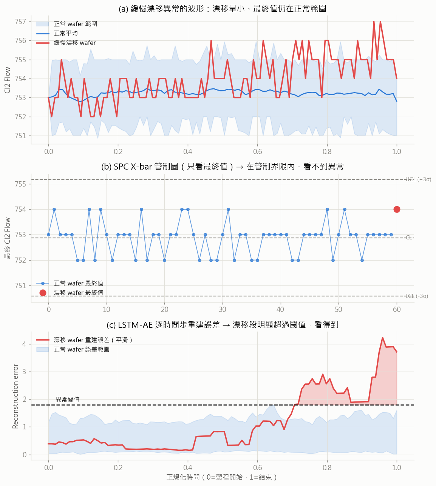

# LSTM AutoEncoder for Semiconductor Anomaly Detection

Detecting **process anomalies that traditional SPC cannot see**, with a strict
methodology: real LAM 9600 Metal Etcher data is used **only** to (1) extract
normal-process statistics and (2) final validation — models are trained purely
on synthetic data generated from those statistics.

## Key results

**Real-data final validation** (20 induced faults, 43 held-out normal wafers
never used for statistics):

| Method | Fault recall | False-alarm rate | AUC |
|---|---|---|---|
| SPC X-bar (final value) | 25% | 0.0% | – |
| Dense AE | 75% | 2.3% | 0.923 |
| **LSTM-AE** | **75%** | 4.7% | 0.880 |

- Faults on **monitored** quantities (Pr, Cl2, He): **8/8 detected (100%)** —
  including the smallest one (Pr +1)
- Faults on unmonitored sensors (TCP/RF): 58% still caught indirectly through
  **closed-loop coupling** (e.g. an RF fault perturbs the pressure loop)
- Direct threshold transfer from synthetic to real: false alarms dropped from
  **100% (v1) to 11.6% (v2)** after the generator was rebuilt from richer
  real statistics

**Synthetic benchmark** (5 random seeds, mean ± std): LSTM-AE F1 = 0.725 ± 0.013
vs SPC X-bar 0.137 and Isolation Forest 0.057.



## Methodology

### Real data is the source of statistics — and the final judge

`01_sensor_stats.py` splits the 107 real normal wafers 60/40. The 60% statistics
set yields, per sensor: **mean waveform profile** (captures ramp direction and the
step-transition transient), residual within-wafer std and lag-1 autocorrelation,
between-wafer offset std, **quantization step**, transient amplitude, and the
process-length distribution. The 40% holdout is reserved as final-validation
negatives and never touches training, model selection, or statistics.

### Synthetic benchmark (v2)

`02_generate_synthetic.py` builds each wafer as: time-rescaled mean profile
(random length 95–112) + between-wafer offset + AR(1) residual noise + integer
quantization. Three anomaly types, all **ending on target** (invisible to
final-value SPC), each hitting 1–2 random sensors:

- **A — ramp too fast**: transient time-axis compressed 2.5–4× + overshoot
  ringing (only on sensors with a real transient)
- **B — mid-process oscillation**: 2.5–4σ damped burst, recovers before the end
- **C — slow drift**: linear drift ending within the ±3σ control limits

### Honest model selection

AE detection quality is **not monotonic in training epochs** — a converged AE
reconstructs anomalies too. Checkpoints (every 20 epochs) × smoothing window ×
peak calibration × threshold rule (mean+3σ vs p99) are grid-selected by F1 on a
**held-out synthetic anomaly validation set**; the test set is touched once per
seed. Results are reported over 5 seeds.

Anomaly score = max of smoothed per-timestep reconstruction error, so localized
anomalies are not diluted by whole-wafer averaging.

## Findings worth stating plainly

1. **Trajectory-based detection is the real win** — both AEs detect 75% of real
   faults vs SPC's 25%. Watching the whole trajectory beats checking the final
   value, regardless of the model family.
2. **A Dense AE matches the LSTM-AE on this benchmark** (and edges it on AUC).
   With profile-locked waveforms resampled to fixed length, position-specific
   weights suffice; the LSTM's advantages here are operational (native
   variable-length input, streaming potential) rather than accuracy.
3. **Synthetic benchmarks must be validated on real data.** v1 of the generator
   (hand-designed ramps, no quantization, fixed length) scored F1 0.86 on its own
   synthetic test set but transferred to real data with 100% false alarms.
   Rebuilding it from richer statistics fixed transfer without ever training on
   real data.

## Pipeline

| Script | What it does |
|---|---|
| `01_sensor_stats.py` | 60/40 split of real normals; extract profile/noise/quantization/length statistics |
| `02_generate_synthetic.py` | Variable-length, quantized synthetic benchmark + separate validation-anomaly set |
| `03_train_lstm_ae.py` | 5-seed training with checkpoint grid selection (resumable) |
| `04_compare_methods.py` | SPC X-bar / Dense AE / Isolation Forest / LSTM-AE under identical protocols |
| `05_validate_real_data.py` | Final validation on held-out real normals + 20 real faults |

## Run

```bash
pip install torch scipy scikit-learn pandas matplotlib
python 01_sensor_stats.py
python 02_generate_synthetic.py
python 03_train_lstm_ae.py      # ~15-25 min on CPU (5 seeds, resumable)
python 04_compare_methods.py
python 05_validate_real_data.py
```

## Dataset

LAM 9600 Metal Etcher data (Eigenvector Research): 108 normal + 21 faulty wafers,
21 engineering variables. Place `MACHINE_Data.mat` at the path configured in
`config.py`. The dataset itself is not redistributed here.

Monitored sensors are chosen from an **equipment-control** viewpoint — controlled
variable (Pressure), actuator (Vat Valve), cooling loop (He Press), flow loop
(Cl2 Flow) — a closed-loop story that needs no plasma chemistry to explain.

## Future Work

- Streaming detection (LSTM forecaster) — alarm mid-process instead of per-wafer
- Extend sensor coverage (TCP/RF power) and quantify the coverage/recall trade-off
- Transformer AutoEncoder comparison
- Edge deployment on Raspberry Pi (ONNX / quantization)
