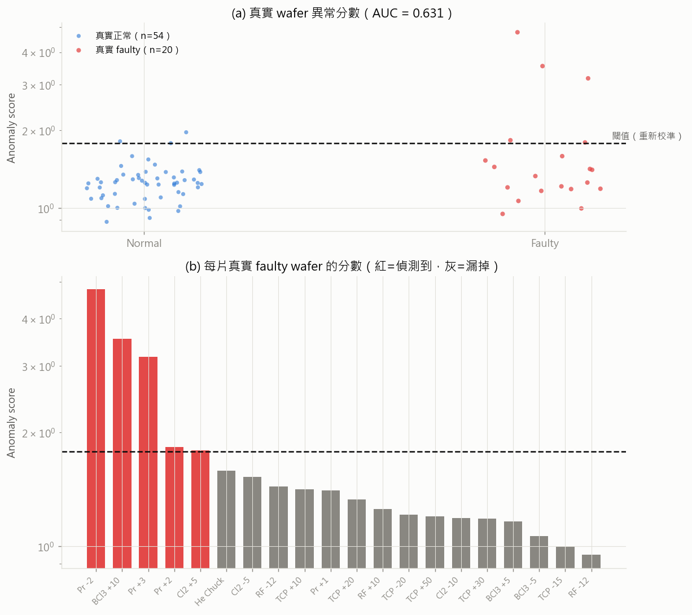

# LSTM AutoEncoder for Semiconductor Anomaly Detection

Detecting **process anomalies that traditional SPC cannot see** — using an LSTM
AutoEncoder trained only on normal wafer sensor traces, validated on both a
synthetic benchmark and **real LAM 9600 Metal Etcher data**.

## Highlights

- **Equipment-control view of sensor selection**: controlled variable (Pressure),
  actuator (Vat Valve), cooling loop (He Press), flow-control loop (Cl2 Flow) —
  a closed-loop story, no plasma chemistry required
- **Synthetic benchmark** designed from real-data statistics (mean, within/between-wafer
  std, lag-1 autocorrelation), with three anomaly types that all **end on target**,
  i.e. invisible to final-value SPC charts
- **Honest model selection**: AE detection quality is *not* monotonic in training
  epochs — checkpoints are selected by F1 on a held-out anomaly validation set
  (never the test set)
- **Real-data validation** exposing the synthetic-to-real domain gap — the step
  most synthetic-benchmark projects skip

## Results — synthetic test set (200 normal + 3 × 100 anomalies)

| Method | Precision | Recall | F1 |
|---|---|---|---|
| SPC X-bar (final value) | 0.94 | 0.10 | 0.18 |
| Isolation Forest | 0.82 | 0.05 | 0.09 |
| Dense AE (no LSTM) | 1.00 | 0.69 | 0.81 |
| **LSTM-AE** | **0.97** | **0.76** | **0.86** |

Per-type detection (LSTM-AE): fast ramp-up **80%**, mid-process oscillation
**85%**, slow drift **64%** — while SPC sees almost nothing (1% / 1% / 27%),
because every anomaly ends within its control limits.


## Results — real faulty wafers (20 induced faults)

Applying the synthetic-trained model to real wafers (threshold recalibrated on
half of the real normal wafers):

- Faults on **monitored** quantities (Pr, Cl2, He): **4 / 8 detected** — all
  pressure-setpoint faults ≥ ±2 caught; only the smallest (Pr +1) missed
- Faults on **unmonitored** sensors (TCP / RF power, BCl3): 1 / 12 — a model
  cannot see faults on signals it does not monitor (sensor-coverage trade-off)
- **Direct threshold transfer fails** (100% false alarms): real signals are
  integer-quantized and contain a step-transition transient the synthetic data
  does not model. This is exactly why real-data validation is mandatory.



## Pipeline

| Script | What it does |
|---|---|
| `01_sensor_stats.py` | Select 4 control-loop sensors, extract statistics from real data |
| `02_generate_synthetic.py` | 500 normal (train) + 100 normal (val) + 150 val-anomalies + 500 test wafers |
| `03_train_lstm_ae.py` | Train LSTM-AE on normal only; grid-select checkpoint × smoothing window × calibration by validation-anomaly F1 |
| `04_compare_methods.py` | SPC X-bar / Dense AE / Isolation Forest / LSTM-AE under identical protocols |
| `05_validate_real_data.py` | Apply the trained model to 107 real normal + 20 real faulty wafers |

Anomaly score = **max of smoothed per-timestep reconstruction error** (window
selected on validation), so localized anomalies are not diluted by whole-wafer
averaging. Threshold = validation mean + 3σ.

### Anomaly types (each perturbs 1–2 random sensors)

- **Type A — ramp too fast**: time constant ÷3 + underdamped overshoot, settles on target
- **Type B — mid-process oscillation**: 2.5–4σ damped oscillation, recovers before end
- **Type C — slow drift**: linear drift ending within the ±3σ SPC control limits

## Run

```bash
pip install torch scipy scikit-learn pandas matplotlib
python 01_sensor_stats.py
python 02_generate_synthetic.py
python 03_train_lstm_ae.py
python 04_compare_methods.py
python 05_validate_real_data.py
```

Outputs land in `outputs/` (data, model, metrics) and `figures/`.

## Dataset

LAM 9600 Metal Etcher data (Eigenvector Research): 108 normal + 21 faulty wafers,
21 engineering variables. Place `MACHINE_Data.mat` at the path configured in
`config.py`. The dataset itself is not redistributed here.

## Lessons Learned

1. **Whole-wafer mean error dilutes localized anomalies** — peak-of-smoothed-error
   scoring raised F1 from 0.62 to 0.86
2. **More training ≠ better detection** — a converged AE reconstructs anomalies
   too; different anomaly types prefer different convergence stages, so model
   selection must use a validation anomaly set
3. **Synthetic benchmarks must be validated against real data** — the domain gap
   (quantization, unmodeled transients) is invisible until you try

## Future Work

- Close the domain gap: quantize synthetic signals, model the step transition
- Fine-tune on real normal wafers
- Variable-length training (real wafers are 95–112 steps)
- Edge deployment on Raspberry Pi (ONNX / quantization)
