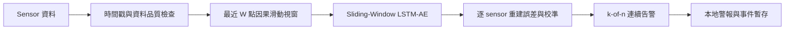

# 論文 V2 實驗整理

## 1. 研究定位

**論文題目：基於邊緣運算與時間序列模型之半導體製程即時異常偵測**

本階段研究範圍收斂為「邊緣端提前預警」。雲端根因分析、持續學習、自動再訓練與模型下發不列入本版實作，只在未來工作說明。

本研究的核心問題不是只判斷 sensor 最終值是否超限，而是辨識最終值可能仍正常、過程軌跡卻已改變的動態異常，例如：

- 壓力、流量、閥門位置或溫度的暫態響應過快或過慢。
- 製程中段出現異常震盪，結束前又回到設定範圍。
- 數值仍在管制界限內，但時間序列持續緩慢漂移。

**信心說明：**程式、因果性、實驗樣本數及輸出數字的信心為高；將合成結果外推到實際晶圓良率、事故預防或毫秒級物理異常的信心為低，現有資料不足以支持該主張。

## 2. V2 系統架構



每次收到時間 `t` 的 sensor 樣本，模型只能使用 `t` 以前的資料。V2 發布模型設定為：

| 項目 | 發布設定 |
|---|---|
| 模型 | Sliding-Window LSTM Autoencoder |
| 隨機種子 | 44 |
| 視窗長度 | 32 點 |
| 分數 | 視窗內逐 sensor 平均重建誤差 |
| Sensor 聚合 | 校準後取最大 sensor 分數 |
| 連續告警 | 最近 5 個分數至少 3 個超過閾值 |
| 發布格式 | PyTorch checkpoint + TorchScript |

模型先以完整正常製程軌跡學習正常 recipe 波形；部署時只重建最近的因果視窗。實驗也評估 `W=8/16/32/64`、最後一點/平均/最大重建誤差、變化量重建誤差，以及 `1/1、2/3、3/5` 告警規則。所有設定由驗證集選擇。

這不是重新訓練一個 sliding-window 模型。V2 重用 Step 3 完整 normal cycle 訓練所得的權重，滑動視窗只改變線上推論方式。

## 3. 分數與告警定義

對 sensor `f`，時間 `t` 的視窗平均重建誤差為：

```text
e(t,f) = (1/W) * sum[(x(i,f) - x_hat(i,f))^2], i=t-W+1...t
```

以正常驗證資料的逐 sensor 平均誤差 `c(f)` 校準後，單點異常分數為：

```text
s(t) = max_f [e(t,f) / c(f)]
```

`3-of-5` 規則等價於取最近 5 個 `s(t)` 的第 3 大值。該值大於閾值時才告警，可降低單點雜訊造成的誤報。合成異常必須在注入 onset 之後，且完整持續告警證據位於 onset 之後，才計為 true positive。

## 4. 資料與切分

| 資料 | 數量與用途 |
|---|---|
| LAM 9600 原始資料 | 108 normal、21 faulty |
| 長度過濾後 | 107 normal、20 faulty |
| 真實 normal 校準/保留 | 64 / 43 |
| 合成訓練 | 500 normal |
| 合成驗證 | 200 normal、A/B/C 各 50 |
| 既有開發測試 | 200 normal、A/B/C 各 100 |
| 低誤報實驗 | 5,000 normal 校準、10,000 normal 測試、300 異常 |
| 最終封存 holdout | 5,000 normal 校準、10,000 normal 測試、A/B/C 各 1,000 |

使用 sensors 為 Cl2 Flow、He Press、Pressure、Vat Valve。資料沒有 Temperature。`Time` 正間隔中位數約 1.0200；若單位為秒，取樣率約 0.980 Hz，因此不能用此資料驗證 0.001 秒等級的實際升溫或壓力變化。

既有 500 片測試集曾在 V2 開發時被查看，故本文將它稱為「開發測試」，不再把它包裝成完全未接觸的最終測試。模型凍結後另以不同亂數種子產生最終 holdout，並保存模型 SHA-256；若後續再調模型，該 holdout 的最終測試資格即失效。

Step 3 的完整序列 checkpoint 與 V2 線上設定都使用同一組合成驗證 cohort，存在重複使用驗證資料而過度配適的可能。最終 holdout 可檢查這項風險，但仍與訓練資料共用同一套合成機制，不能視為獨立的真實物理驗證。

## 5. V2 開發實驗

5 seeds 的開發測試結果：

| 指標 | Mean | Std |
|---|---:|---:|
| Precision | 0.946 | 0.007 |
| Recall | 0.424 | 0.028 |
| F1 | 0.585 | 0.028 |
| Normal-wafer FPR | 0.036 | 0.005 |
| ROC-AUC | 0.720 | 0.017 |
| Pre-onset alarm rate | 0.000 | 0.000 |

各異常型態的 Recall 平均：

| 異常類型 | Recall mean | 解讀 |
|---|---:|---|
| A：暫態響應速度異常 | 0.030 | 主模型明顯不足 |
| B：過程震盪 | 0.556 | 可偵測部分中段震盪 |
| C：緩慢漂移 | 0.686 | 三類中表現最好 |

發布 seed 44 在開發測試的 Recall 為 0.457、FPR 為 0.040、F1 為 0.616。這些數字不能取代最終 holdout。

## 6. 低誤報與異常盛行率

在 5,000 片獨立 normal 校準、10,000 片獨立 normal 測試時：

| 模型 | 目標 FPR | 實測 FPR | Recall | 異常率 1% 時投影 Precision |
|---|---:|---:|---:|---:|
| Sliding-Window LSTM-AE | 1.0% | 0.96% | 0.400 | 0.296 |
| Sliding-Window LSTM-AE | 0.5% | 0.61% | 0.387 | 0.390 |
| Sliding-Window LSTM-AE | 0.1% | 0.14% | 0.297 | 0.682 |
| Causal LSTM Forecaster | 1.0% | 1.26% | 0.657 | 0.345 |
| Causal LSTM Forecaster | 0.5% | 0.61% | 0.597 | 0.497 |
| Causal LSTM Forecaster | 0.1% | 0.15% | 0.530 | 0.781 |

投影 Precision 使用：

```text
Precision = Recall * prevalence /
            [Recall * prevalence + FPR * (1 - prevalence)]
```

這說明平衡資料上的高 Precision 不能直接代表產線。當異常率只有 1% 時，即使 FPR 約 1%，主模型發出的警報也只有約 28% 到 30% 預期為真異常。

## 7. 最終封存 holdout

模型設定凍結後，以 10,000 normal 與 A/B/C 各 1,000 的全新資料評估：

| 模型 | 目標 FPR | 實測 FPR (95% CI) | Recall (95% CI) |
|---|---:|---:|---:|
| Sliding-Window LSTM-AE | 1.0% | 0.91% (0.74%-1.12%) | 0.358 (0.341-0.375) |
| Sliding-Window LSTM-AE | 0.5% | 0.44% (0.33%-0.59%) | 0.318 (0.302-0.335) |
| Sliding-Window LSTM-AE | 0.1% | 0.11% (0.06%-0.20%) | 0.250 (0.235-0.265) |
| Causal LSTM Forecaster | 1.0% | 0.98% (0.80%-1.19%) | 0.603 (0.585-0.620) |
| Causal LSTM Forecaster | 0.5% | 0.59% (0.46%-0.76%) | 0.575 (0.558-0.593) |
| Causal LSTM Forecaster | 0.1% | 0.28% (0.19%-0.40%) | 0.536 (0.518-0.553) |

主模型在 1% 目標下偵測 1,073/3,000 片異常，正常誤報 91/10,000。各類 Recall 為 A `0.015`、B `0.492`、C `0.566`。Forecaster 的 A/B/C Recall 為 `0.635/0.579/0.594`，顯示一步預測對快速暫態更合適。

正式部署預設 operating point 為 `final_calibration_fpr_1pct`，threshold `2.2915715737547067`，由 5,000 片 final calibration normal 決定；final holdout anomaly labels 沒有用來調整 threshold。checkpoint 內的 `2.079145039482915` 僅代表原始 validation operating point，不再作為正式預設。

**可支持的結論：**Sliding-Window LSTM-AE 能在不使用未來資料的條件下，以低於約 1% 的 normal-wafer FPR 偵測部分震盪與漂移異常，且可封裝到邊緣端逐筆執行。

**不支持的結論：**目前結果不支持「主模型可可靠偵測所有動態異常」，也不支持「已可直接在半導體產線上線」。

## 8. 真實資料 sanity check

真實資料以 64 normal 校準、43 normal 保留及 20 faulty 評估。V2 主模型結果：

| 項目 | 結果 |
|---|---:|
| Normal FPR | 0/43 = 0.000 |
| Fault recall | 5/20 = 0.250 |
| ROC-AUC | 0.658 |
| 成功偵測樣本首次告警進度中位數 | 0.380 |

64 片校準資料的 FPR 觀察解析度只有 `1/64=1.5625%`；0/43 也不代表真實 FPR 為零。真實 faulty 主要是設定點偏移，沒有經工程師確認的 fault onset，故只能作 domain-gap sanity check。

## 9. 邊緣部署結果

| 項目 | 結果 |
|---|---:|
| 參數量 | 53,588 |
| TorchScript 大小 | 223.7 KiB |
| 本機單執行緒 mean | 依執行主機約 0.5-0.8 ms |
| 本次 p95 | 1.089 ms |
| 本次 p99 | 1.538 ms |
| 離線/邊緣最大分數差 | 6.75e-7 |
| 告警決策一致 | 是 |

基準包含標準化、視窗更新、TorchScript、逐 sensor 分數、連續告警與決策；不含 sensor 通訊、資料庫寫入及警報傳輸。這是 Windows 開發主機結果，不是 Raspberry Pi 實測。32 點視窗在約 0.98 Hz 資料上還需先累積約 32 秒才產生第一個分數；推論只需 1 ms 不代表能偵測毫秒級物理事件。

## 10. V2 相對第一版的改進

1. 主模型由完整 wafer 結束後評分，改為只使用過去資料的 Sliding-Window LSTM-AE。
2. 新增視窗長度、誤差彙整及 k-of-n 連續告警的驗證選擇。
3. 新增 pre-onset 排除，避免把異常發生前的誤報算成提前命中。
4. 新增 5-seed、低 FPR、大量 normal、異常盛行率與 Wilson 95% CI。
5. 新增最終封存 holdout，承認既有測試集曾參與開發觀察。
6. 新增 TorchScript 邊緣 artifact、逐筆 runtime、時間戳檢查、reset 及離線/線上一致性測試。
7. 真實資料加入 V2 主模型重新校準與首次告警進度。
8. 明確區分「推論延遲」與「sensor 可觀測的異常時間尺度」。

## 11. 論文章節建議

### 第一章 緒論

- 研究背景：SPC 終值/單點監控可能忽略製程軌跡。
- 研究動機：大量時間序列需要在設備附近即時處理。
- 研究目的：建立因果式邊緣異常偵測原型並評估誤報、偵測與延遲。
- 研究貢獻：因果滑動視窗、可控動態異常、低盛行率評估、邊緣 artifact。

### 第二章 文獻回顧

- 半導體製程監控與 SPC。
- One-class anomaly detection 與 Autoencoder。
- LSTM-AE、時間序列 forecasting 及 edge AI。
- 異常盛行率、FPR 與告警疲勞。

本章仍需補正式文獻搜尋與引用；目前專案沒有足夠來源可直接生成可信參考文獻。

### 第三章 研究方法

- LAM 9600 資料與固定切分。
- 正常波形統計與 A/B/C 合成機制。
- Sliding-Window LSTM-AE、分數公式與連續告警。
- 因果資訊限制、模型選擇與資料防洩漏。
- TorchScript 邊緣部署流程。

### 第四章 實驗結果

- SPC、Dense AE、Isolation Forest、完整 LSTM-AE 與 Forecaster 對照。
- 5-seed 開發結果。
- 大 normal cohort 低 FPR 結果。
- 最終封存 holdout 與 95% CI。
- 真實資料 domain-gap sanity check。
- 邊緣推論速度與 artifact parity。

### 第五章 結論與未來工作

- 主模型可因果執行並控制低誤報，但 Recall 尚不足。
- Forecaster 在快速暫態明顯較佳，證明比較模型不可省略。
- 下一步為 Raspberry Pi 實測、高頻真實 sensor、recipe/setpoint、yield/fault onset 標籤。
- 雲端根因分析、持續學習、模型治理與安全回滾列為未來工作。

## 12. 截止日前仍需完成

1. 在 Raspberry Pi 或指定 edge device 實測 p50/p95/p99、CPU、RSS、功耗與長時間掉樣率。
2. 完成第二章文獻搜尋、引用與參考文獻格式。
3. 與教授確認：主模型結果低於 Forecaster 時，是否仍以 LSTM-AE 為主模型，或把研究題目維持「時間序列模型」並將兩者並列。
4. 將圖 `08、09、10、11` 放入第四章，補圖說與表號。
5. 若取得新真實高頻資料，另開新實驗版本；不得用新結果覆寫本次封存 holdout。

## 13. 產出對照

- `outputs/sliding_window_metrics.json`：5-seed、發布設定、延遲及 artifact parity。
- `outputs/prevalence_evaluation.json`：低 FPR 與盛行率投影。
- `outputs/final_holdout_evaluation.json`：最終封存 holdout 與 95% CI。
- `outputs/real_validation.json`：真實資料 sanity check。
- `outputs/edge_deployment_manifest.json/.sha256`：部署 profile、artifact 與完整實驗 provenance。
- `figures/08_sliding_window_results.png`：主模型類型 Recall 與告警時間線。
- `figures/09_low_fpr_comparison.png`：低 FPR 比較。
- `figures/10_real_online_validation.png`：真實資料比較。
- `figures/11_locked_holdout.png`：最終 holdout 摘要。
